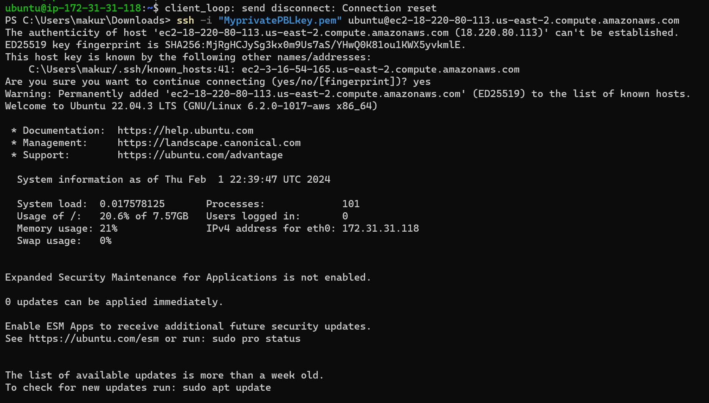
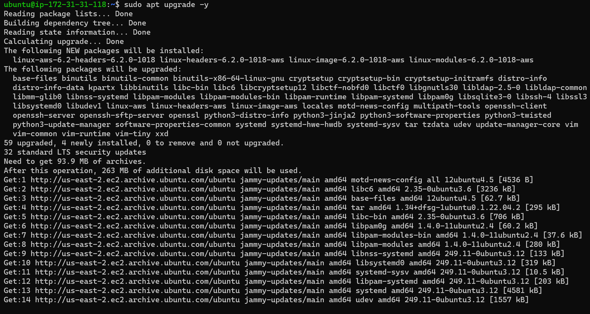

# MEAN STACK DEPLOYMENT TO UBUNTU IN AWS

## Step 1: Install NodeJs

### Update Ubuntu

`sudo apt update`



### Upgrade ubuntu

`sudo apt upgrade`



### Add Certificates

`sudo apt -y install curl dirmngr apt-transport-https lsb-release ca-certificates`

`curl -sL https://deb.nodesource.com/setup_12.x | sudo -E bash -`


### Install NodeJS

`sudo apt install -y nodejs`


## Step 2: Install MongoDB

### MongoDB stores data in flexible, JSON-like documents. Fields in a database can vary from document to document and data structure can be changed over time. For the application, I am adding book records to MongoDB that contain book name, isbn number, author, and number of pages.mages/WebConsole.gif

### Running the command below:

`sudo apt-key adv --keyserver hkp://keyserver.ubuntu.com:80 --recv 0C49F3730359A14518585931BC711F9BA15703C6`

### And:

`echo "deb [ arch=amd64 ] https://repo.mongodb.org/apt/ubuntu trusty/mongodb-org/3.4 multiverse" | sudo tee /etc/apt/sources.list.d/mongodb-org-3.4.list`


### Installing MongoDB

`sudo apt install -y mongodb`


### Starting The server

`sudo service mongodb start`


### To verify that the service is up and running

`sudo systemctl status mongodb`


### Install npm – Node package manager.

`sudo apt install -y npm`


### Installing body-parser package. I need ‘body-parser’ package to help process JSON files passed in requests to the server.

`sudo npm install body-parser`


### Creating a folder named ‘Books’

`mkdir Books && cd Books`


### Iniliazing npm project In the Books directory

`npm init`


### Adding a file to it named server.js

`vi server.js`


### Copy and paste the web server code below into the server.js file

```
var express = require('express');
var bodyParser = require('body-parser');
var app = express();
app.use(express.static(__dirname + '/public'));
app.use(bodyParser.json());
require('./apps/routes')(app);
app.set('port', 3300);
app.listen(app.get('port'), function() {
    console.log('Server up: http://localhost:' + app.get('port'));
});
```

# INSTALLING EXPRESS AND SETTING UP ROUTES TO THE SERVER

## Step 3: Install Express and set up routes to the server

### Express is a minimal and flexible Node.js web application framework that provides features for web and mobile applications. I will use Express in to pass book information to and from the MongoDB database.

### I will also use Mongoose package which provides a straight-forward, schema-based solution to model my application data. I will use Mongoose to establish a schema for the database to store the data of the book register.

`sudo npm install express mongoose`


### In ‘Books’ folder, a folder named apps is created

`mkdir apps && cd apps`


### Creating a file named routes.js

`vi routes.js`


### Inputting the code below into routes.js

```
var Book = require('./models/book');
module.exports = function(app) {
  app.get('/book', function(req, res) {
    Book.find({}, function(err, result) {
      if ( err ) throw err;
      res.json(result);
    });
  }); 
  app.post('/book', function(req, res) {
    var book = new Book( {
      name:req.body.name,
      isbn:req.body.isbn,
      author:req.body.author,
      pages:req.body.pages
    });
    book.save(function(err, result) {
      if ( err ) throw err;
      res.json( {
        message:"Successfully added book",
        book:result
      });
    });
  });
  app.delete("/book/:isbn", function(req, res) {
    Book.findOneAndRemove(req.query, function(err, result) {
      if ( err ) throw err;
      res.json( {
        message: "Successfully deleted the book",
        book: result
      });
    });
  });
  var path = require('path');
  app.get('*', function(req, res) {
    res.sendfile(path.join(__dirname + '/public', 'index.html'));
  });
};
```

### In the ‘apps’ folder, a folder named models is created

`mkdir models && cd models`


### Creating a file named book.js

`vi book.js`


### Inputting the code below into ‘book.js’

```
var mongoose = require('mongoose');
var dbHost = 'mongodb://localhost:27017/test';
mongoose.connect(dbHost);
mongoose.connection;
mongoose.set('debug', true);
var bookSchema = mongoose.Schema( {
  name: String,
  isbn: {type: String, index: true},
  author: String,
  pages: Number
});
var Book = mongoose.model('Book', bookSchema);
module.exports = mongoose.model('Book', bookSchema);`
```

## Step 4 – Accessing the routes with AngularJS

### AngularJS provides a web framework for creating dynamic views in your web applications. In this project, we use AngularJS to connect the web page with Express and perform actions on our book register.
### Changing the directory back to ‘Books’

`cd ~/Books`


### Creating a folder named public

`mkdir public && cd public`


### Adding a file named script.js

`vi script.js`


### Inputting the Code below (controller configuration defined) into the script.js file.

```
var app = angular.module('myApp', []);
app.controller('myCtrl', function($scope, $http) {
  $http( {
    method: 'GET',
    url: '/book'
  }).then(function successCallback(response) {
    $scope.books = response.data;
  }, function errorCallback(response) {
    console.log('Error: ' + response);
  });
  $scope.del_book = function(book) {
    $http( {
      method: 'DELETE',
      url: '/book/:isbn',
      params: {'isbn': book.isbn}
    }).then(function successCallback(response) {
      console.log(response);
    }, function errorCallback(response) {
      console.log('Error: ' + response);
    });
  };
  $scope.add_book = function() {
    var body = '{ "name": "' + $scope.Name + 
    '", "isbn": "' + $scope.Isbn +
    '", "author": "' + $scope.Author + 
    '", "pages": "' + $scope.Pages + '" }';
    $http({
      method: 'POST',
      url: '/book',
      data: body
    }).then(function successCallback(response) {
      console.log(response);
    }, function errorCallback(response) {
      console.log('Error: ' + response);
    });
  };
});
```

### In public folder, creating a file named index.html;

`vi index.html`


### Inputting the code below into index.html file.

```
<!doctype html>
<html ng-app="myApp" ng-controller="myCtrl">
  <head>
    <script src="https://ajax.googleapis.com/ajax/libs/angularjs/1.6.4/angular.min.js"></script>
    <script src="script.js"></script>
  </head>
  <body>
    <div>
      <table>
        <tr>
          <td>Name:</td>
          <td><input type="text" ng-model="Name"></td>
        </tr>
        <tr>
          <td>Isbn:</td>
          <td><input type="text" ng-model="Isbn"></td>
        </tr>
        <tr>
          <td>Author:</td>
          <td><input type="text" ng-model="Author"></td>
        </tr>
        <tr>
          <td>Pages:</td>
          <td><input type="number" ng-model="Pages"></td>
        </tr>
      </table>
      <button ng-click="add_book()">Add</button>
    </div>
    <hr>
    <div>
      <table>
        <tr>
          <th>Name</th>
          <th>Isbn</th>
          <th>Author</th>
          <th>Pages</th>

        </tr>
        <tr ng-repeat="book in books">
          <td>{{book.name}}</td>
          <td>{{book.isbn}}</td>
          <td>{{book.author}}</td>
          <td>{{book.pages}}</td>

          <td><input type="button" value="Delete" data-ng-click="del_book(book)"></td>
        </tr>
      </table>
    </div>
  </body>
</html>
```

### Changing directory back up to Books

`cd ~/Books`


### Starting the server by running this command:

`node server.js`


### The server is now up and running, I can connect it via port 3300, launching a separate SSH console to test what curl command returns locally.

`curl -s http://localhost:3300`


### Accessing the server over the internet on port 3300

[Public IP Address on port 3300](http://3.234.229.88/:3300)


## End of MEAN STACK IMPLEMENTATION

# Project Completion
